# 68-Java-使用Maven创建聚合工程.md

1. 新建一个Maven工程

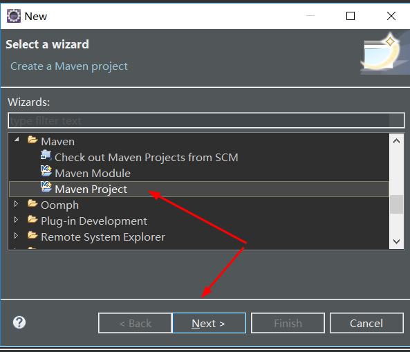


勾选 Create a simple project (skip archetype selection)

如图所示，location里会有默认为别的项目的空间，我进行的尝如下：

去掉勾选 Use default Workspace location 清空Location：里的路径
完成之后再次勾选 Use default Workspace location

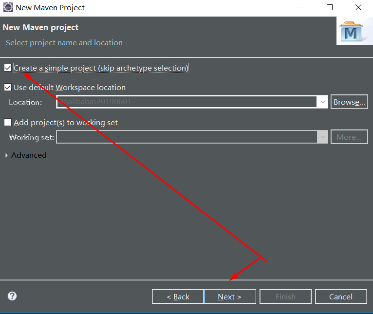

结果就成这样咯。。。。不能点击Next。。。显示我是没有解决这个bug

**最终解决方法：**

windows ---> Preferences ---> Global Settings (open file) 配置好即可解决这个bug

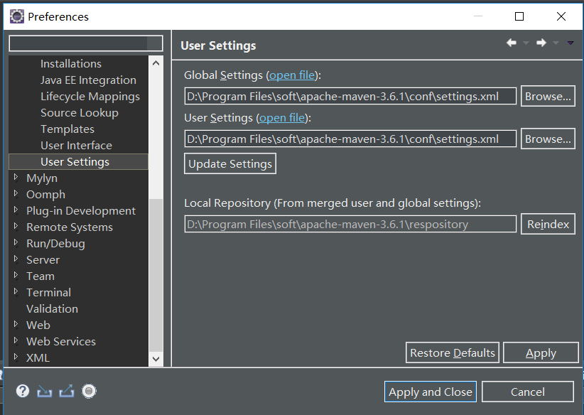

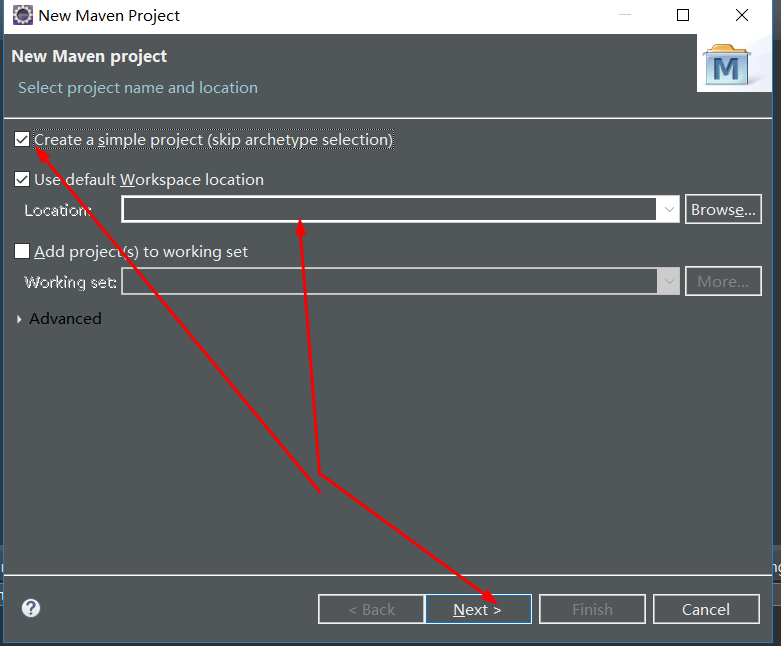

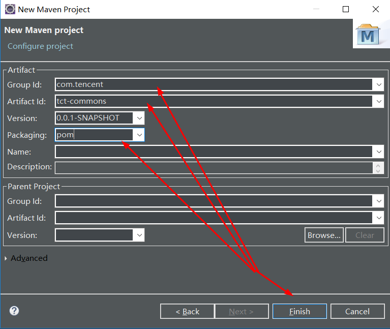

这样一个Maven工程就创建好咯。。。

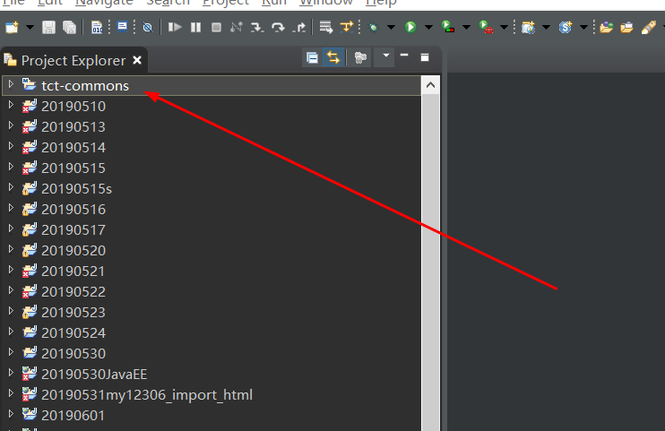

2. 因tct-commons这个总的工程下面有很多子的工程，所以再创建一个Maven Module

File ---> NEW ---> Maven ---> Maven Module ---> Next

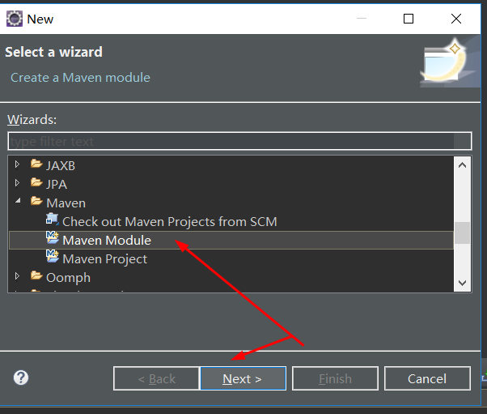

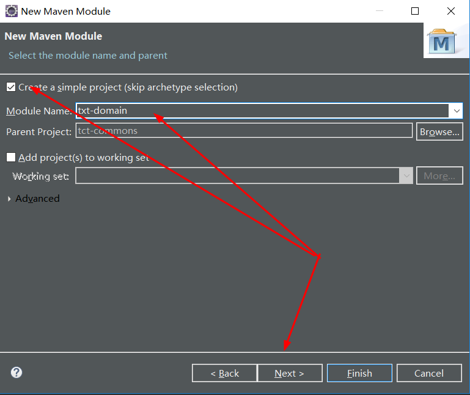

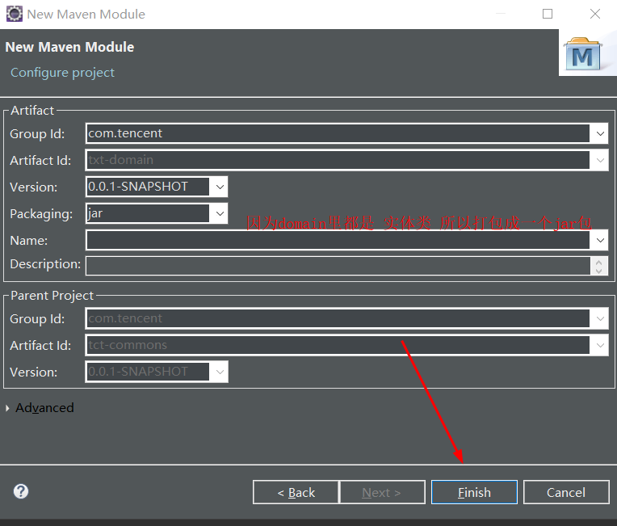


+ 打开txt-commons里的pom.xml,可以看到这里面已经有子级txt-domain的配置咯

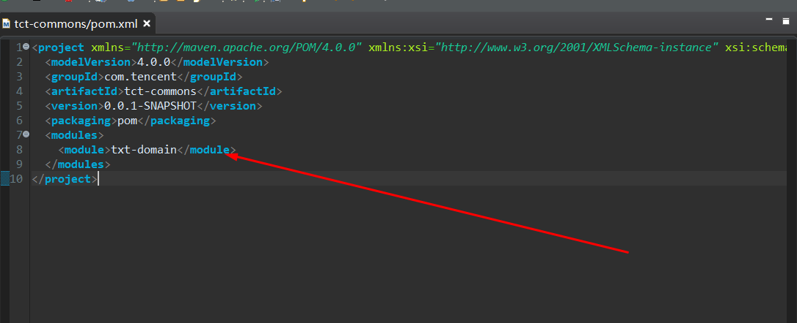

3. 同样的操作再创建一个Maven Module tct-dao

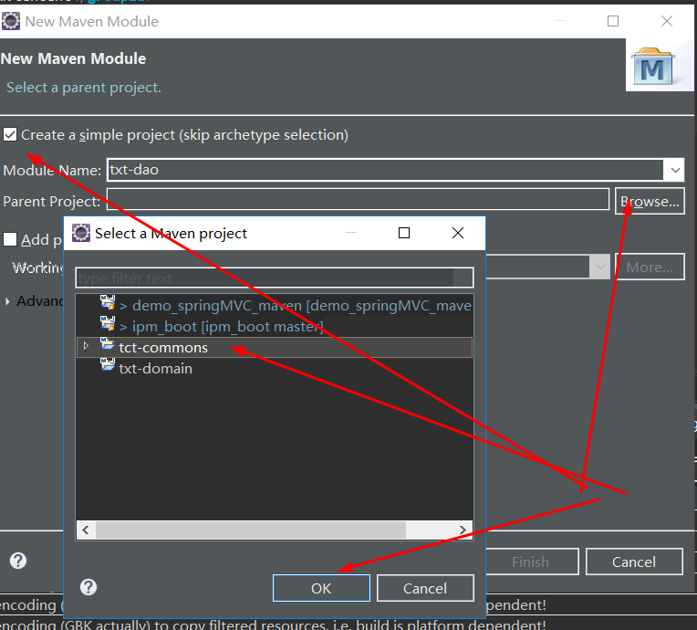

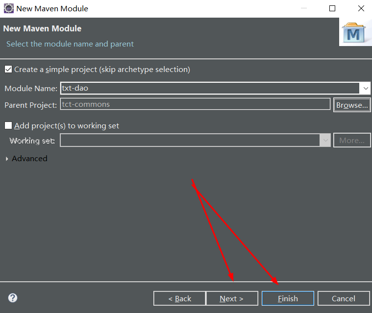

这里父级工程里的pom.xml已经自动更新

```
<project xmlns="http://maven.apache.org/POM/4.0.0" xmlns:xsi="http://www.w3.org/2001/XMLSchema-instance" xsi:schemaLocation="http://maven.apache.org/POM/4.0.0 http://maven.apache.org/xsd/maven-4.0.0.xsd">
  <modelVersion>4.0.0</modelVersion>
  <groupId>com.tencent</groupId>
  <artifactId>tct-commons</artifactId>
  <version>0.0.1-SNAPSHOT</version>
  <packaging>pom</packaging>
  <modules>
  	<module>txt-domain</module>
  	<module>txt-dao</module>
  </modules>
</project>
```
3. 同样的操作再创建一个Maven Module tct-service

**注：**

刚刚起错名咯。。将前缀名为txt的工程更改为tct

4. 创建一个Maven Module tct-controller 需要勾选war包因为是web工程

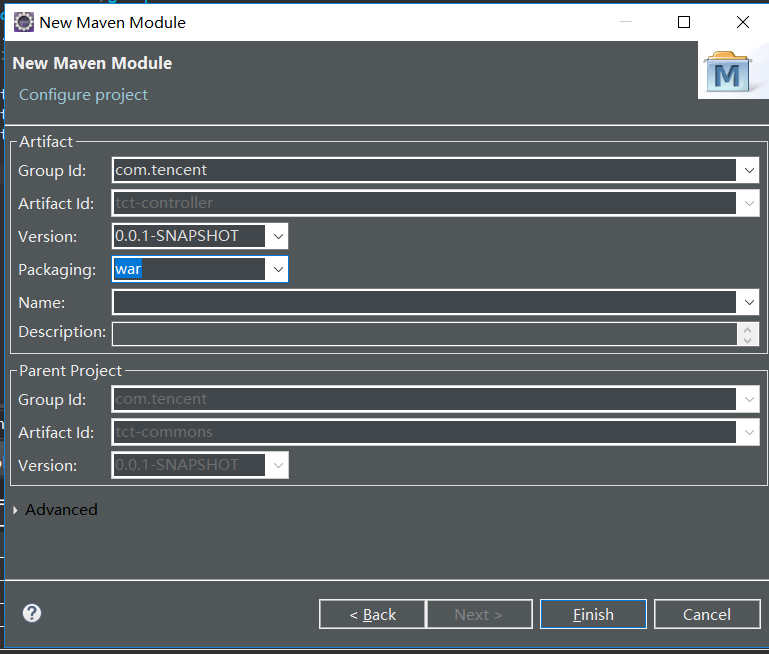

tct-commons里的pom.xml

```
<project xmlns="http://maven.apache.org/POM/4.0.0" xmlns:xsi="http://www.w3.org/2001/XMLSchema-instance" xsi:schemaLocation="http://maven.apache.org/POM/4.0.0 http://maven.apache.org/xsd/maven-4.0.0.xsd">
  <modelVersion>4.0.0</modelVersion>
  <groupId>com.tencent</groupId>
  <artifactId>tct-commons</artifactId>
  <version>0.0.1-SNAPSHOT</version>
  <packaging>pom</packaging>
  <modules>
  	<module>tct-domain</module>
  	<module>tct-dao</module>
  	<module>tct-service</module>
  	<module>tct-controller</module>
  </modules>
</project>
```
**注：以后创建工程越来越大的时候，我们不但把模块分开，而且模块里面层与层也分开，这样分开分得很细，会让实施工程师/运维工程师很为难，但对于开发来说就很开心，因为只需要配置好这个模块就行**


依赖关系 dao 层依赖 domain service 依赖 dao controller 依赖 service 所以需要在对应工程的 pom.xml 里配置依赖

**配置tct-dao里的pom.xml**

```
<project xmlns="http://maven.apache.org/POM/4.0.0" xmlns:xsi="http://www.w3.org/2001/XMLSchema-instance" xsi:schemaLocation="http://maven.apache.org/POM/4.0.0 http://maven.apache.org/xsd/maven-4.0.0.xsd">
  <modelVersion>4.0.0</modelVersion>
  <parent>
    <groupId>com.tencent</groupId>
    <artifactId>tct-commons</artifactId>
    <version>0.0.1-SNAPSHOT</version>
  </parent>
  <artifactId>txt-dao</artifactId>
  <dependencies>
	  <dependency>
		  <groupId>com.tencent</groupId>
		  <artifactId>tct-domain</artifactId>
    	  <version>0.0.1-SNAPSHOT</version>
	  </dependency>
  </dependencies>
</project>
```

**报错信息如下：**

```
Missing artifact com.tencent:tct-domain:jar:0.0.1-SNAPSHOT
```

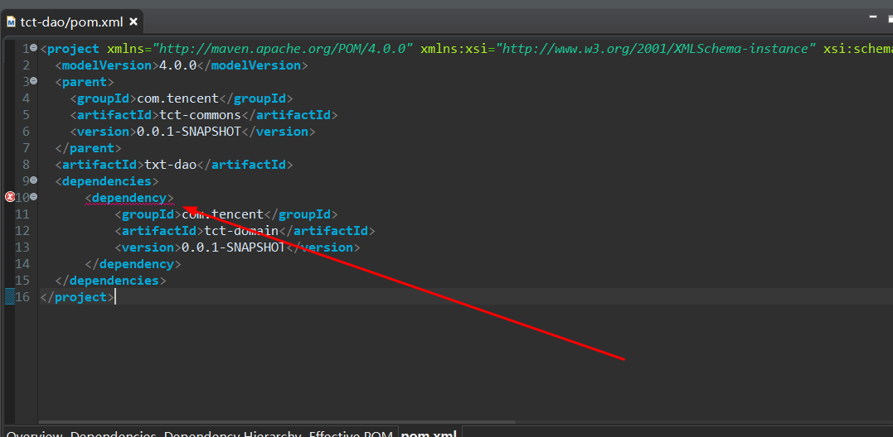

**原因：** 之前的命名错误，将前缀txt更改为tct之后pom.xml里的artifactId标签里依然是txt-dao 

**解决方法：** 将所有工程里的pom.xml里的artifactId标签里前缀为txt更改为 tct，更改完成之后，如图所示报错解决

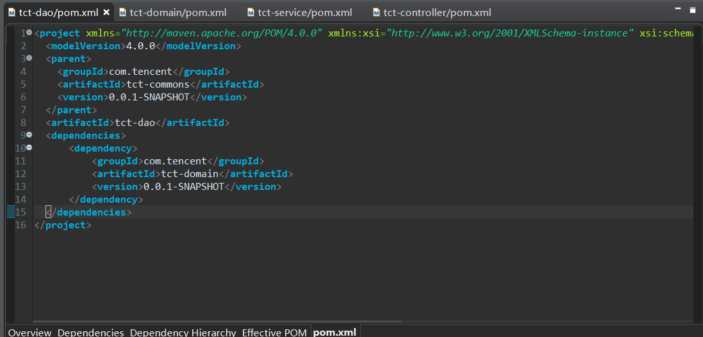

5. 在domain工程里写一个实体类

```
package com.tencent.easyJava.domain;
/**
 * User实体类
* <p>Title: User</p>  
* <p>Description: </p>  
* @author xianxian 
* @date 2019年6月27日
 */
public class User {

	private Integer id;
	private String name;
	public Integer getId() {
		return id;
	}
	public void setId(Integer id) {
		this.id = id;
	}
	public String getName() {
		return name;
	}
	public void setName(String name) {
		this.name = name;
	}
}
```

6. 在dao工程里写一个dao类看看是否能够导入其它工程的实体类，如图所示成功导入，未报错。

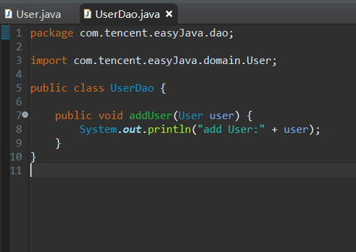

```
package com.tencent.easyJava.dao;

import com.tencent.easyJava.domain.User;

public class UserDao {

	public void addUser(User user) {
		System.out.println("add User:" + user);
	}
}
```

**以就就是我关于 Java-使用Maven创建聚合工程  知识点的整理与总结的全部内容 [另附源码](https://github.com/javaobjects/tct-commons)**

==================================================================
#### 分割线
==================================================================

**博主为咯学编程：父母不同意学编程，现已断绝关系;恋人不同意学编程，现已分手;亲戚不同意学编程，现已断绝来往;老板不同意学编程,现已失业三十年。。。。。。如果此博文有帮到你欢迎打赏，金额不限。。。**

 